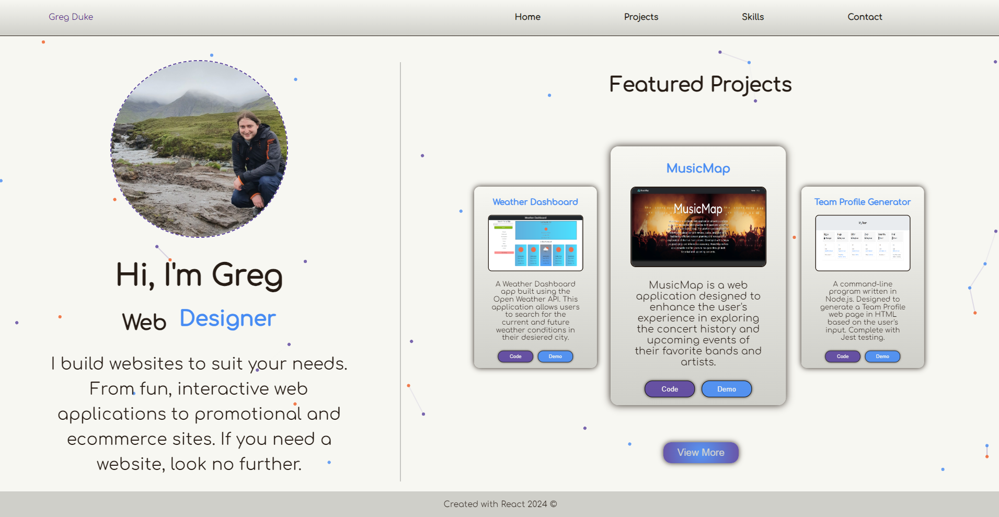
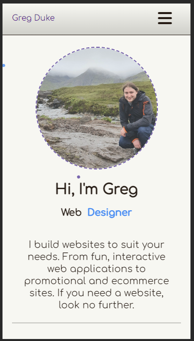

# My Portfolio

## Description

My personal portfolio, built using React.js. My protfolio features a Home page containing an About Me section as well as a Featured Projects section.

There is a Projects page which contains project cards which feature projects that I have built during my time on the Front-End Skills Bootcamp, as well as some other personal projects; all project cards use `props` which are given as data from a `.json` file.

Next a Skills page which shows some skill cards with Languages and Tools that I have learned both via the Bootcamp and in my own time. Plus some additional skills cards and a link to my resume.

Lastly, there is a contact page where you will find links to my social media accounts and a form from which you can send me a message. Valid messages will be automatically emailed to me.

Below are a couple of screenshots showing the Home page of my protfolio in both desktop and mobile format.

## Usage

My portfolio can be accessed via this link:

## Credits

The applications was build using React.js with React Router Dom

Animations were achieved with the Framer-Motion and React Text Transition modules.

Emails are sent using Email.js
